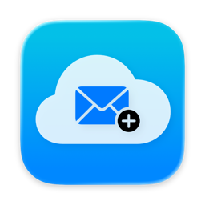

<p align="center">
  
</p>

<h1 align="center">HideMyEmail Generator</h1>

<p align="center">
  通过原生 macOS 应用、可选 Android 配套客户端或本地命令行生成、保留和管理 iCloud「隐藏邮件地址」。
  <br>
  包含 macOS 原生登录、Android 客户端、Windows 启动器、iCloud 中国区支持和本地收件台。
</p>

<p align="center">
  <a href="LICENSE"></a>
  
  <a href="../../releases/latest"></a>
  <a href="../../releases"></a>
</p>

<p align="center">
  <a href="./README.md">English</a>
  ·
  <strong>简体中文</strong>
  ·
  <a href="./README.ru.md">Русский</a>
</p>

> 需要有效的 iCloud+ 订阅，才能生成「隐藏邮件地址」。

## 应用预览

<p align="center">
  <a href="../../releases/latest/download/HideMyEmail-Generator-macOS-Apple-Silicon.dmg"><strong>下载 Apple 芯片版（.dmg）</strong></a>
  ·
  <a href="../../releases/latest/download/HideMyEmail-Generator-macOS-Intel.dmg"><strong>下载 Intel 版（.dmg）</strong></a>
</p>

<p align="center">
  
</p>

- 使用自定义标签，一次生成一个或一批地址。
- 复制单个地址、复制全部地址，或导出本地历史记录。
- 安排大批量生成；遇到 Apple 频率限制时自动暂停并恢复。
- 使用原生 iCloud 登录，将会话保存在钥匙串，并随时查看连接状态。
- 地址历史仅保存在本机，应用不收集遥测数据。

<p align="center">
  
  
</p>

## 目录

- [应用预览](#应用预览)
- [功能亮点](#功能亮点)
- [快速开始](#快速开始)
- [macOS 应用](#macos-应用)
- [Android 应用](#android-应用)
- [Windows 启动器](#windows-启动器)
- [命令行用法](#命令行用法)
- [Cookie 管理](#cookie-管理)
- [本地收件台和验证码](#本地收件台和验证码)
- [配置](#配置)
- [本地文件](#本地文件)
- [故障排查](#故障排查)
- [安全和隐私](#安全和隐私)
- [频率限制](#频率限制)
- [免责声明](#免责声明)
- [致谢](#致谢)
- [许可证](#许可证)

## 功能亮点

| 功能 | 说明 |
| --- | --- |
| 生成地址 | 按指定标签创建并保留 iCloud「隐藏邮件地址」。 |
| 查看地址 | 查看使用中或已停用的隐藏邮件地址。 |
| 查看账号 | 显示当前 Cookie 对应的 Apple ID、DSID、用户分区和功能可用性。 |
| iCloud 中国区 | 使用 `icloud.com.cn` 的 Origin、校验接口和 maildomain 主机。 |
| 分区检测 | 从捕获请求或账号校验结果推导正确的 `pNNN-maildomainws` 主机。 |
| 原生 macOS 应用 | 批量生成、浏览并导出本地历史记录，并在遇到频率限制时自动等待。 |
| Android 应用 | 为 Android 用户提供国际区/中国区 iCloud、地址生成和本地状态管理。 |
| Windows 启动器 | 双击即可生成、查看和管理 Cookie。 |
| 双语界面 | 启动器和 CLI 帮助包含英文和简体中文。 |
| 自动捕获 Cookie | 打开 iCloud+，点击「隐藏邮件地址」，捕获应用请求并保存 Cookie。 |
| 本地收件台 | 通过 IMAP 拉取转发邮件，并在本地提取验证码。 |
| 状态管理 | 将地址标记为 `unused`、`used` 或 `trash`。 |
| 表格导出 | 导出本地地址和邮件数据，便于表格管理。 |

## 快速开始

### 下载预构建二进制

从[最新发行版](../../releases/latest)下载独立二进制文件，无需安装 Python 或 `uv`。

- **Windows：** 下载 `hidemyemail-windows.exe`。双击打开交互式菜单，或在终端中带参数运行以使用命令行（`hidemyemail-windows.exe --help`）。
- **macOS 应用：** M 系列 Mac 下载
  [Apple 芯片版 DMG](../../releases/latest/download/HideMyEmail-Generator-macOS-Apple-Silicon.dmg)，
  Intel Mac 下载
  [Intel 版 DMG](../../releases/latest/download/HideMyEmail-Generator-macOS-Intel.dmg)。
  首次启动时，请在访达中右键点击应用并选择**打开**。
- **macOS 命令行：** Apple 芯片下载 `hidemyemail-macos`，Intel 下载
  `hidemyemail-macos-x86_64`。执行 `chmod +x` 后从终端运行。
- **Android 应用：** 构建 [`android/`](android/) 目录中的源码。

原生应用会在登录后捕获自己的 iCloud 会话。预构建的命令行二进制仍需手动获取
Cookie；自动获取（Playwright）仅在源码运行时可用。

### 源码运行

```bash
git clone https://github.com/rtunazzz/hidemyemail-generator.git
cd hidemyemail-generator
uv sync --python 3.12
```

Windows 下双击 `start-hidemyemail.bat`。直接使用命令行：

```bash
uv run hidemyemail --help
```

## macOS 应用

应用需要 macOS 13 或更高版本，并内置命令行辅助程序，无需安装 Python 或
`uv`。

1. 打开应用并选择 **Connect iCloud**。
2. 完成 Apple 系统账号提示或备用登录表单。会话验证成功后，登录窗口会自动关闭。
3. 使用 **Generate** 生成一个或一批地址，在 **Emails** 中查看、复制和导出，
   或使用 **Scheduler** 按设定间隔持续生成。

会话会在本地验证并存储到 macOS 钥匙串。每次调用辅助程序时，会话只会通过仅限
当前用户读取的临时文件传递，并在调用后立即删除。生成记录存储在本机。

如果 Apple 限制生成频率，应用会保留已完成的地址、显示倒计时，并在至少 30 分钟
后自动重试；调度运行期间需要保持应用开启。

## Android 应用

可选 Android 客户端支持 Android 6.0（API 23）及以上版本，为 Android 用户提供
管理自己 iCloud+「隐藏邮件地址」的移动端界面。它支持国际区和中国大陆区 iCloud、
原始 `Cookie` Header 或浏览器 **Copy as cURL** 导入、账号校验、地址生成、使用中/
已停用地址列表、标签和备注编辑、停用/重新启用，以及本地 `unused` / `used` / `trash`
状态管理。界面提供英文和简体中文资源，并会跟随设备语言。

在本仓库中构建：

```bash
cd android
bash ./gradlew testDebugUnitTest
bash ./gradlew assembleDebug
```

Windows 下使用 `./gradlew.bat`。生成的 Debug APK 位于
`android/app/build/outputs/apk/debug/app-debug.apk`。

## Windows 启动器

推荐在 Windows 上使用启动器。

```text
1. Generate emails
2. List active emails
3. List inactive emails
4. Manage iCloud cookie
5. Local inbox and codes
6. Exit
```

Cookie 管理菜单：

```text
1. Show current cookie account
2. Replace iCloud cookie
3. Auto capture iCloud cookie
4. Back
```

收件台菜单：

```text
1. Configure inbox IMAP account
2. Sync inbox and show verification codes
3. Show recent verification codes
4. Show recent inbox messages
5. List unused local emails
6. Mark email as used
7. Move email to trash
8. Sync iCloud HME addresses to local DB
9. Export CSV files
10. Back
```

启动器默认使用 `global` 区域。如需使用 iCloud 中国区，请在启动前设置环境变量：

```text
HIDEMYEMAIL_REGION=china
```

## 命令行用法

命令默认使用 `global` 区域。加上 `--region china`（或设置
`HIDEMYEMAIL_REGION=china`）即可切换到 iCloud 中国区。

### 生成地址

```bash
uv run hidemyemail generate --label test --count 1 --cookie-file cookies.txt
```

常用参数：

| 参数 | 说明 |
| --- | --- |
| `--label` | 生成地址的标签，必填。 |
| `--count` | 生成数量，默认 `1`。 |
| `--cookie-file` | Cookie 文件路径，默认 `cookies.txt`。 |
| `--output` | 生成结果追加写入文件，默认 `emails.txt`。 |
| `--no-output-file` | 只打印结果，不写文件。 |
| `--region` | `global`（默认）或 `china`。 |

### 查看地址

```bash
uv run hidemyemail list --active --cookie-file cookies.txt
uv run hidemyemail list --inactive --cookie-file cookies.txt
```

### 查看当前账号

```bash
uv run hidemyemail whoami --cookie-file cookies.txt
```

示例输出：

```text
Current iCloud Cookie
Apple ID       +86 ***********
Name           Example User
DSID           ***********
Hide My Email  Available
User Partition 217
Maildomain     p217-maildomainws.icloud.com.cn
```

### 自动捕获 Cookie

```bash
uv sync --extra capture
uv run hidemyemail capture-cookie --cookie-file cookies.txt
```

### 本地收件台

配置接收 iCloud 转发邮件的邮箱：

```bash
uv run hidemyemail inbox setup
```

同步最新邮件并显示验证码：

```bash
uv run hidemyemail inbox sync --limit 100 --show-codes
```

查看最近验证码：

```bash
uv run hidemyemail inbox codes --limit 30
```

同步 iCloud 里已有的隐藏邮箱到本地数据库：

```bash
uv run hidemyemail inbox sync-hme --cookie-file cookies.txt
```

管理地址状态：

```bash
uv run hidemyemail inbox addresses --state unused
uv run hidemyemail inbox mark example@icloud.com used
uv run hidemyemail inbox mark example@icloud.com trash
```

导出 CSV：

```bash
uv run hidemyemail inbox export
```

## Cookie 管理

工具需要已登录 iCloud 的浏览器 Cookie。Cookie 只保存在本地 `cookies.txt`，
并已加入 Git 忽略。

### 自动捕获

1. 运行 `start-hidemyemail.bat`。
2. 选择 `4. Manage iCloud cookie`。
3. 选择 `3. Auto capture iCloud cookie`。
4. 如果打开的浏览器要求登录，请登录 iCloud。
5. 工具会打开 iCloud+ 页面，点击「隐藏邮件地址」，捕获应用请求，校验 Cookie，
   并写入 `cookies.txt`。

自动捕获监听的隐藏邮件地址应用请求：

```text
https://www.icloud.com/applications/hidemyemail/current/en-us/index.html?rootDomain=www
```

中国区对应的主机为 `www.icloud.com.cn`，语言段为 `zh-cn`。

它使用独立浏览器配置目录：

```text
.cookie-browser-profile
```

它不会读取你的日常浏览器配置。如果成功捕获新 Cookie，旧文件会备份为：

```text
cookies.txt.bak
```

### 手动捕获

1. 打开 `https://www.icloud.com/icloudplus/`（中国区使用 `www.icloud.com.cn`）。
2. 按 `F12`。
3. 打开 `Network / 网络`。
4. 点击「Hide My Email / 隐藏邮件地址」卡片。
5. 找到以下请求：

   ```text
   /applications/hidemyemail/current/en-us/index.html?rootDomain=www
   ```

6. 右键请求，选择 `Copy / 复制` -> `Copy as cURL / 复制为 cURL`。
7. 将整段内容粘贴到 `cookies.txt`。

直接粘贴原始 `Cookie:` 请求头也可以。

## 本地收件台和验证码

本地收件台通过 IMAP 读取接收 iCloud 隐藏邮箱转发邮件的邮箱。它会把邮件元数据、
匹配到的隐藏邮箱地址和提取出的验证码保存到本地 SQLite 数据库。

它会做：

- 连接你配置的接收邮箱 IMAP；
- 从指定文件夹同步新邮件；
- 从邮件标题和正文中提取可能的验证码；
- 尽量把邮件关联到已知隐藏邮箱；
- 将隐藏邮箱标记为 `unused`、`used` 或 `trash`；
- 导出 `addresses.csv` 和 `messages.csv`。

它不会做：

- 不上传邮件或验证码到任何服务器；
- 不需要公网部署；
- 不读取你的日常浏览器配置；
- 不绕过 Apple 或邮箱服务商的频率限制。

很多邮箱服务商要求使用“应用专用密码”，不要直接使用网页登录密码。

## Camoufox 浏览器批量获取 Session

网页服务现在可以复用 `openai-register-paylink-ui` 项目的“浏览器取选中 / 浏览器取全部”
认证工作器，并把邮箱与验证码来源替换为本项目的 iCloud 隐藏邮箱：

- 网页列出当前 iCloud 账号下的全部有效隐藏邮箱；
- 有效 Access Token 自动跳过，过期 Token 自动重新获取；
- 支持单个邮箱和全部邮箱、1–10 并发、可见或无头 Camoufox；
- 只接受本次认证开始后、与目标隐藏邮箱匹配的 OpenAI 验证码；
- 一键注册不再在本机定时生成邮箱；每次注册都从远端 iCloud 服务领取库存邮箱；
- 邮箱账号页可设置 SMSBower API Key，按最高价自动购买真实 `@gmail.com` 激活，
  使用 OpenAI 服务代码 `dr` 自动轮询邮件验证码；成功注册后，本机会保留激活 ID 最多
  24 小时并请求继续接收下一封验证码。SMSBower 获取邮箱接口不支持指定有效时长，
  因而 24 小时是本机复用上限，不是服务商保证；服务商若提前终止激活会立即标记失效；
- 远端每个整点尝试生成 5 个库存邮箱，领取后锁定 10 分钟；每个邮箱只会被自动领取
  一次，成功标记为 `used`，失败、取消或超时则标记为 `trash` 并永久退出自动库存；
- 成功后把 OpenAI 密码、Session、Access Token 和浏览器 storage state 保存在
  `hidemyemail.db` 的本地设置表中；敏感结果不会写入任务日志；
- 可以在网页中停止当前任务。真实浏览器任务不会在测试或服务启动时自动执行。

Windows 本地会依次查找以下同级目录：

```text
../openai-register-paylink
../openai-register-paylink-ui-dist-20260706-README-deploy
```

该目录必须已经安装项目依赖和 Camoufox 运行时。也可以用下面的环境变量指定：

```text
OPENAI_REGISTER_PROJECT_DIR=D:\path\to\openai-register-project
OPENAI_REGISTER_PYTHON=D:\path\to\openai-register-project\.venv\Scripts\python.exe
```

服务器部署使用 `Dockerfile.remote-browser`。构建目录需要包含
`openai-register-runtime/`（只放目标项目顶层 Python 源文件，不要复制 `state.json`、
日志、代理或账号数据）。服务器强制使用无头浏览器。

### Mail Auth 协议注册

账号工作台左侧新增 **协议注册** 入口，可勾选待处理账号或运行“协议注册全部”。
该流程不启动浏览器，直接执行 Mail Auth、邮箱 OTP、OAuth callback 与 Session 获取；
返回 Session 后会继续确认至少 12 位密码，并创建、验证及激活 TOTP 2FA。只有
Session、密码和 2FA 三项均完成时，账号才显示“协议注册完成（密码+2FA）”。

协议内核默认从同级目录 `gptfree-register` 或 `D:\AI\gptfree-register` 加载；也可用
`GPTFREE_REGISTER_ROOT` 和 `GPTFREE_REGISTER_PYTHON` 指定内核目录与 Python 运行时。

### 一键验证与账号分类

“一键验证账号”会并发查询所有已保存 Access Token 的账号，并把在线有效账号归类为
`Plus` 或 `Free`。没有 AT 的邮箱保持“等待验证”。只有两个独立账号接口都明确返回
401 时才判定为无效；403 或套餐不明确时一律保留。已识别为 `Plus` 的账号即使 Token
过期也不会被移除，只会提示重新获取 Session。两个接口都返回 401 时也只会清除失效
的 AT、Session 和浏览器状态，邮箱、密码、MFA 密钥及套餐分类都会保留，以便重新认证；
此操作不会停用或删除 Apple 侧的 iCloud 隐藏邮箱。

## 配置

| 配置 | 值 | 说明 |
| --- | --- | --- |
| `--region` | `china`, `global` | 选择 iCloud 中国区或全球区接口。 |
| `HIDEMYEMAIL_REGION` | `china`, `global` | 命令行和启动器的可选默认区域，默认 `global`。 |
| `OPENAI_REGISTER_PROJECT_DIR` | 路径 | Camoufox 浏览器工作器源项目目录。 |
| `OPENAI_REGISTER_PYTHON` | 路径 | 已安装目标项目依赖和 Camoufox 的 Python。 |
| `HIDEMYEMAIL_BROWSER_SERVICE_URL` | URL | 浏览器工作器回调本服务读取 iCloud 验证码的本机地址。 |
| `HIDEMYEMAIL_FORCE_BROWSER_HEADLESS` | `0`, `1` | 设为 `1` 时强制所有浏览器任务使用无头模式。 |
| `HIDEMYEMAIL_INVENTORY_URL` | URL | 远端 iCloud 邮箱库存服务地址。 |
| `HIDEMYEMAIL_INVENTORY_TOKEN` | 令牌 | 领取邮箱和提交注册回执使用的共享令牌。 |
| `SMSBOWER_API_KEY` | 令牌 | 可选的 SMSBower API Key；也可在邮箱账号页点击「SMSBower API」保存在本地数据库。 |
| `SMSBOWER_MAIL_SERVICE` | 服务代码 | SMSBower 邮件服务代码，OpenAI (ChatGPT) 默认为 `dr`。 |
| `SMSBOWER_MAX_PRICE` | 美元 | 单个 Gmail 激活的最高价，默认 `0.05`。 |
| `ACCOUNT_WORKBENCH_IMPORT_TOKEN` | 令牌 | 仅用于本地 OpenAI 账户工作台导入；必须与工作台 `.env` 的 `HME_IMPORT_TOKEN` 相同。 |
| `HIDEMYEMAIL_REMOTE_TOKEN` | 令牌 | 仅供部署脚本和手动访问远端验证码服务使用。 |
| `HIDEMYEMAIL_INVENTORY_SERVER` | `0`, `1` | 仅在后台服务设为 `1`，启用定时库存生成和租约 API。 |
| `HIDEMYEMAIL_INVENTORY_LEASE_SECONDS` | 秒数 | 邮箱领取锁定时间，默认 `600` 秒。 |
| `HIDEMYEMAIL_INVENTORY_BATCH_SIZE` | 数量 | 后台每轮生成数量，默认 `5`。 |
| `HIDEMYEMAIL_INVENTORY_INTERVAL_SECONDS` | 秒数 | 后台生成间隔，默认 `3600` 秒；该值为 `3600` 时对齐到每个整点。 |
| `cookies.txt` | 本地文件 | 保存捕获到的 Cookie。 |
| `emails.txt` | 本地文件 | 保存生成的隐藏邮件地址。 |
| `inbox_config.json` | 本地文件 | 保存接收邮箱 IMAP 配置。 |
| `hidemyemail.db` | 本地文件 | 保存地址、邮件元数据和验证码的 SQLite 数据库。 |

## 本地文件

以下文件只在本地使用，已加入 Git 忽略：

- `cookies.txt`
- `cookies.txt.bak`
- `emails.txt`
- `hidemyemail.db`
- `hidemyemail.db-*`
- `inbox_config.json`
- `exports/`
- `.cookie-browser-profile/`
- `.venv/`

## 故障排查

| 现象 | 处理方式 |
| --- | --- |
| `Missing X-APPLE-WEBAUTH-USER cookie` | 捕获「隐藏邮件地址」应用请求，不要使用 `feedbackws/reportStats`。 |
| `Request timed out` | 重试。命令行已经增加超时和重试，但 iCloud 偶尔仍会慢。 |
| Cookie 对应账号不对 | 用启动器 `4 -> 1` 查看账号，再用 `4 -> 3` 重新捕获。 |
| 自动捕获无法打开浏览器 | 安装 Microsoft Edge，然后运行 `uv sync --extra capture` 或 `uv run playwright install chromium`。 |
| 中文在旧控制台里乱码 | 使用启动器；启动器会切换到 UTF-8。 |
| IMAP 登录失败 | 确认邮箱已开启 IMAP，并按邮箱服务商要求使用应用专用密码。 |
| 没有识别出验证码 | 用 `hidemyemail inbox messages` 查看标题和正文预览；有些服务商格式不标准。 |

## 安全和隐私

- Cookie 只保存在本地，并已被 Git 忽略。
- IMAP 配置和本地收件数据只保存在本地，并已被 Git 忽略。
- SMSBower API Key 只保存在本地数据库或本地 `.env`，状态接口和任务日志不会回传。
- 浏览器任务只把当前认证所需的邮箱和验证码提交给 OpenAI 官方认证页面；Session、AT 和密码只保存在本地数据库。
- 自动捕获使用独立浏览器配置。
- 项目不会主动收集、上传或分享你的 Cookie、邮件数据或验证码。
- 不要提交 `cookies.txt`、`cookies.txt.bak`、`emails.txt`、`inbox_config.json`、`hidemyemail.db`、导出目录或浏览器配置目录。
- 如果 token 或 Cookie 被意外公开，请到对应平台撤销或重新生成。

## 频率限制

Apple 可能限制「隐藏邮件地址」创建频率。经验值大约是：
每 30 分钟可创建 `5 * iCloud 家庭人数` 个地址，观察到的总量上限约为 700 个。

## 免责声明

本项目是独立社区工具，不隶属于 Apple Inc.，也未获得 Apple Inc. 的认可或赞助。
Apple、iCloud 和 Hide My Email 是 Apple Inc. 的商标。

## 致谢

- iCloud 中国区支持、Windows 启动器、本地收件台和 Android 配套客户端由 [@never-seek](https://github.com/never-seek) 贡献。
- 同时感谢其他[社区贡献者](https://github.com/rtunazzz/hidemyemail-generator/graphs/contributors)。

## 许可证

MIT。见 [LICENSE](./LICENSE)。
